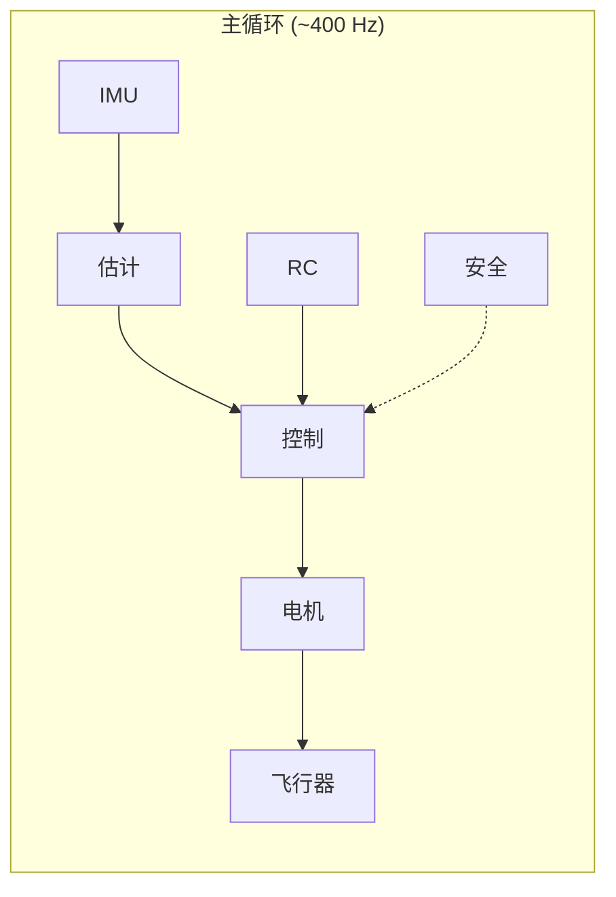

# 固件概述

Flix-mpy 是 flix 四轴飞行器固件的 MicroPython 实现，专为 ESP32 微控制器设计。固件遵循经典的嵌入式系统设计模式，包含初始化代码和主循环。

## 数据流



主循环以约 400 Hz 运行。数据流通过全局变量进行，包括：

### 全局变量

| 变量 | 类型 | 说明 |
|------|------|------|
| `t` | float | 当前步骤时间 (秒) |
| `dt` | float | 时间增量 (秒) |
| `loop_rate` | float | 循环频率 (Hz) |
| `gyro` | Vector | 陀螺仪数据 (rad/s) |
| `acc` | Vector | 加速度计数据 (m/s²) |
| `rates` | Vector | 滤波后的角速率 (rad/s) |
| `attitude` | Quaternion | 估计的姿态 |
| `control_roll` | float | 横滚控制输入 [-1, 1] |
| `control_pitch` | float | 俯仰控制输入 [-1, 1] |
| `control_yaw` | float | 偏航控制输入 [-1, 1] |
| `control_throttle` | float | 油门控制输入 [0, 1] |
| `control_mode` | float | 模式控制输入 |
| `control_time` | float | 最后控制信号时间 |
| `landed` | bool | 是否已着陆 |
| `motors` | float[4] | 电机输出 [0, 1] |

## 模块结构

固件源文件位于 `flix-mpy` 目录中：

### 核心模块

| 文件 | 说明 |
|------|------|
| `main.py` | 主程序入口，全局变量定义和主循环 |
| `lib/control.py` | 飞行控制子系统，三级级联 PID 控制器 |
| `lib/estimate.py` | 姿态估计，互补滤波器 |
| `lib/imu.py` | IMU 传感器读取和校准 |
| `lib/motors.py` | PWM 电机输出控制 |
| `lib/rc.py` | RC 接收机读取和校准 |

### 通信模块

| 文件 | 说明 |
|------|------|
| `lib/wifi.py` | Wi-Fi 网络连接 |
| `lib/mavlink.py` | MAVLink 协议实现 |
| `lib/cli.py` | 命令行界面 |

### 工具模块

| 文件 | 说明 |
|------|------|
| `lib/vector.py` | 三维向量数学库 |
| `lib/quaternion.py` | 四元数旋转库 |
| `lib/pid.py` | 通用 PID 控制器 |
| `lib/lpf.py` | 低通滤波器 |
| `lib/util.py` | 工具函数 |

### 系统模块

| 文件 | 说明 |
|------|------|
| `lib/parameters.py` | 参数存储和管理 |
| `lib/log.py` | 飞行日志记录 |
| `lib/led.py` | LED 状态指示 |
| `lib/safety.py` | 安全保护功能 |

## 控制子系统

飞行员输入在 `_interpret_controls()` 中解释，然后转换为控制命令：

### 控制命令

| 变量 | 类型 | 说明 |
|------|------|------|
| `attitude_target` | Quaternion | 目标姿态 |
| `rates_target` | Vector | 目标角速率 (rad/s) |
| `rates_extra` | Vector | 附加角速率 (前馈) |
| `torque_target` | Vector | 目标扭矩 [-1, 1] |
| `thrust_target` | float | 集体推力 [0, 1] |

### 控制层级

```
姿态控制 ──> 角速度控制 ──> 扭矩混合 ──> 电机输出
```

1. **姿态控制** (`_control_attitude`): 将姿态误差转换为角速度目标
2. **角速度控制** (`_control_rates`): 将角速度误差转换为扭矩目标
3. **扭矩混合** (`_control_torque`): 将扭矩分配到四个电机

### 飞行模式

| 模式 | 常量 | 说明 |
|------|------|------|
| RAW | 0 | 原始模式，直接控制扭矩 |
| ACRO | 1 | 特技模式，控制角速度 |
| STAB | 2 | 姿态模式，控制倾斜角度 |
| AUTO | 3 | 自主模式，由 MAVLink 控制 |

## 主循环

```python
def loop():
    imu.read()        # 读取 IMU 数据
    step()            # 更新时间
    rc.read()         # 读取 RC 数据
    estimate.estimate()  # 估计姿态
    control.control()    # 执行控制
    motors.send()     # 发送电机信号
    cli.handle_input()   # 处理命令
    mavlink.process()    # 处理 MAVLink
    log.log_data()    # 记录日志
    parameters.sync()    # 同步参数
```

## 与 Arduino 版本的差异

| 特性 | Arduino 版本 | MicroPython 版本 |
|------|-------------|-----------------|
| 循环频率 | 1000 Hz | ~400 Hz |
| 内存管理 | 静态分配 | 动态分配 |
| 导入方式 | 编译时链接 | 运行时导入 |
| 参数存储 | EEPROM | JSON 文件 |
| 调试方式 | 串口打印 | REPL 交互 |

## 性能优化

为了在 MicroPython 中获得最佳性能：

1. 使用 `__slots__` 减少对象内存占用
2. 避免在循环中创建新对象
3. 使用模块级变量而非类属性
4. 延迟导入减少启动时间
